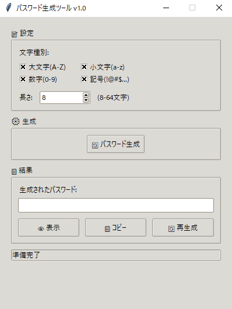

# 🔐 パスワード生成ツール

**高品質で安全なパスワードを簡単に生成できる GUI アプリケーション**


## 📋 目次

-   [概要](#-概要)
-   [主な機能](#-主な機能)
-   [技術仕様](#-技術仕様)
-   [インストールと実行](#-インストールと実行)
-   [使用方法](#-使用方法)
-   [アーキテクチャ](#-アーキテクチャ)
-   [テスト](#-テスト)
-   [ファイル構成](#-ファイル構成)
-   [セキュリティ](#-セキュリティ)
-   [カスタマイズ・拡張](#-カスタマイズ・拡張)
-   [開発者向け情報](#-開発者向け情報)
-   [開発ガイド](#-開発ガイド)
-   [ライセンス](#-ライセンス)
-   [バージョン履歴](#-バージョン履歴)

## 🎯 概要

このパスワード生成ツールは、**MVC アーキテクチャパターン**を採用した Python 製の GUI アプリケーションです。セキュリティ要件に応じたカスタマイズ可能なパスワードを生成し、使いやすいグラフィカルインターフェースを提供します。

### ✨ 特徴

-   🎨 **直感的な GUI**: tkinter による使いやすいインターフェース
-   🔧 **カスタマイズ可能**: 文字種・長さを自由に設定
-   🏗️ **堅牢な設計**: MVC パターンによる保守性の高いコード
-   🧪 **包括的テスト**: 単体テスト・統合テストによる品質保証
-   📋 **ワンクリックコピー**: 生成したパスワードの即座コピー
-   👁️ **表示制御**: パスワードの表示・非表示切り替え

## 📸 アプリケーション外観

<div align="center">



_シンプルで直感的なユーザーインターフェース_

</div>

## 🚀 主な機能

### パスワード生成機能

-   **文字種別選択**
    -   大文字 (A-Z)
    -   小文字 (a-z)
    -   数字 (0-9)
    -   記号 (!@#$%^&\*...)
-   **長さ設定**: 8 ～ 64 文字の範囲で指定
-   **高品質乱数**: 暗号学的に安全な乱数生成

### ユーザーインターフェース

-   **リアルタイム設定**: チェックボックスとスピンボックスによる直感的操作
-   **視覚的フィードバック**: ステータスバーでの操作状況表示
-   **エラーハンドリング**: 分かりやすいエラーメッセージ

### 利便性機能

-   **クリップボード連携**: ワンクリックでパスワードコピー
-   **表示制御**: セキュリティを考慮した表示・非表示切り替え
-   **再生成**: 同じ設定で新しいパスワードを瞬時生成

## 🛠️ 技術仕様

| 項目                     | 詳細                               |
| ------------------------ | ---------------------------------- |
| **言語**                 | Python 3.8+                        |
| **GUI フレームワーク**   | tkinter (標準ライブラリ)           |
| **アーキテクチャ**       | MVC (Model-View-Controller)        |
| **テストフレームワーク** | unittest (標準ライブラリ)          |
| **暗号化ライブラリ**     | secrets (標準ライブラリ)           |
| **クリップボード**       | tkinter.clipboard (標準ライブラリ) |

### システム要件

-   Python 3.8 以上
-   tkinter (通常は Python に標準搭載)
-   Windows / macOS / Linux

## 📦 インストールと実行

### 1. リポジトリのクローン

```bash
git clone https://github.com/doro-git/password_generator.git
cd password-generator
```

### 2. 実行

```bash
# メインアプリケーション起動
python main.py

# または直接コントローラー実行
python controller.py
```

### 3. テスト実行（オプション）

```bash
# 単体テスト
python test_model.py

# 統合テスト
python test_integration.py
```

## 🖥️ 使用方法

### 基本的な使い方

1. **アプリケーション起動**

    ```bash
    python main.py
    ```

2. **パスワード設定**

    - 使用したい文字種別をチェック
    - パスワード長を 8 ～ 64 文字で設定

3. **パスワード生成**

    - 「🔄 パスワード生成」ボタンをクリック

4. **パスワード利用**
    - 「👁 表示」: パスワードの表示・非表示切り替え
    - 「📋 コピー」: クリップボードにコピー
    - 「🔄 再生成」: 同じ設定で新しいパスワード生成

### 使用例

#### ウェブサイト用パスワード（推奨）

-   ✅ 大文字・小文字・数字・記号すべて使用
-   📏 長さ: 16 文字以上

#### WiFi パスワード（記号なし）

-   ✅ 大文字・小文字・数字のみ
-   ❌ 記号なし（一部機器で問題を避けるため）
-   📏 長さ: 20 ～ 32 文字

#### PIN 風パスワード

-   ❌ 大文字・小文字・記号なし
-   ✅ 数字のみ
-   📏 長さ: 8 ～ 12 文字

## 🏗️ アーキテクチャ

本アプリケーションは**MVC パターン**を採用し、関心の分離による保守性を実現しています。

```
┌─────────────────┐    ┌──────────────────┐    ┌─────────────────┐
│     View        │    │   Controller     │    │     Model       │
│   (view.py)     │◄──►│ (controller.py)  │◄──►│   (model.py)    │
│                 │    │                  │    │                 │
│ ・GUI表示       │     │ ・イベント処理    │    │ ・パスワード生成  │
│ ・ユーザー入力   │    │  ・データ変換     │    │ ・バリデーション  │
│ ・結果表示       │    │  ・エラー処理     │    │ ・クリップボード  │
└─────────────────┘    └──────────────────┘    └─────────────────┘
```

### 各層の責務

| 層              | ファイル        | 責務                                                     |
| --------------- | --------------- | -------------------------------------------------------- |
| **Model**       | `model.py`      | ビジネスロジック、データ処理、パスワード生成アルゴリズム |
| **View**        | `view.py`       | GUI 表示、ユーザーインターフェース、入力受付             |
| **Controller**  | `controller.py` | Model と View の仲介、イベント処理、フロー制御           |
| **Entry Point** | `main.py`       | アプリケーション起動、初期化処理                         |

## 🧪 テスト

本プロジェクトは**2 層のテスト戦略**で品質を保証しています。

### 1. 単体テスト (`test_model.py`)

**対象**: Model 層の各機能を個別検証

#### テストカバレッジ

-   ✅ **正常系テスト**: 各パスワード生成パターン
-   ❌ **異常系テスト**: 不正な入力値の処理
-   🔄 **境界値テスト**: 最小・最大長でのパスワード生成
-   🎲 **ランダム性テスト**: 生成パスワードの一意性確認

#### 実行例

```bash
$ python test_model.py

test_generate_password_default_settings ... ok
test_generate_password_uppercase_only ... ok
test_generate_password_boundary_lengths ... ok
test_generate_password_no_character_types_selected ... ok
test_copy_to_clipboard_success ... ok

Ran 15 tests in 0.123s
OK
```

### 2. 統合テスト (`test_integration.py`)

**対象**: MVC 各層の協調動作を検証

#### 革新的なテスト設計

**🎯 ヘッドレス View 技術**

```python
class HeadlessPasswordGeneratorView:
    """GUI表示なしでテスト実行可能なView"""
    def __init__(self):
        self.root = tk.Tk()
        self.root.withdraw()  # ウィンドウ非表示
```

**メリット**:

-   🚀 **高速実行**: GUI 描画オーバーヘッドなし
-   🤖 **CI/CD 対応**: サーバー環境での自動テスト
-   🔧 **デバッグ容易**: テスト専用の状態監視

#### 統合テストの検証項目

-   🔄 **エンドツーエンドフロー**: View 入力 → Controller 処理 → Model 実行 → View 表示
-   ❌ **エラー伝播**: 各層でのエラーハンドリング連携
-   🎛️ **設定反映**: UI 設定の正確な Model 層への伝達
-   📋 **コピー機能**: クリップボード連携の統合動作

#### 実行例

```bash
$ python test_integration.py

🧪 統合テスト実行開始
============================================================
test_mvc_initialization ... ok
test_password_generation_flow ... ok
test_error_handling_integration ... ok
============================================================
✅ 統合テスト完了 - 全テストパス！
```

### テスト品質の特徴

1. **包括的カバレッジ**: 機能・異常・境界・統合すべてをカバー
2. **継続的品質保証**: CI/CD パイプラインでの自動実行対応
3. **保守性**: テストコード自体の可読性・拡張性を重視
4. **実用性**: 実際のユーザー操作パターンを忠実に再現

## 📁 ファイル構成

```
password_generator/
│
├── README.md                 # このファイル
├── main.py                   # アプリケーション起動点
├── model.py                  # Model層: ビジネスロジック
├── view.py                   # View層: GUI表示
├── controller.py             # Controller層: 制御ロジック
├── test_model.py             # 単体テスト: Model層
├── test_integration.py       # 統合テスト: MVC協調
└── __pycache__/              # Python キャッシュ (自動生成)
```

### ファイル詳細

| ファイル              | 役割・特徴                                  |
| --------------------- | ------------------------------------------- |
| `main.py`             | アプリケーション起動、エントリーポイント    |
| `model.py`            | パスワード生成・検証などビジネスロジック    |
| `view.py`             | GUI 構築・イベント処理                      |
| `controller.py`       | MVC の協調制御、イベント仲介                |
| `test_model.py`       | Model 層の単体テスト                        |
| `test_integration.py` | MVC 全体の統合テスト                        |
| `__pycache__/`        | Python のキャッシュディレクトリ（自動生成） |

## 🔒 セキュリティ

### 暗号学的安全性

-   Python 標準の `secrets.SystemRandom()` 使用
-   OS の暗号学的に安全な乱数生成器を活用
-   予測不可能なパスワード生成を保証

### プライバシー保護

-   **ローカル処理**: ネットワーク通信なし、完全オフライン動作
-   **データ保存なし**: 生成パスワードの永続化なし
-   **履歴なし**: パスワード生成履歴の記録なし

## 🔧 カスタマイズ・拡張

### 新機能の追加方法

#### 1. 新しい文字種の追加

1. `model.py`の文字定数を更新
2. `view.py`にチェックボックス追加
3. テストケースを追加

#### 2. パスワード保存機能の追加

1. **Model 層**: ファイル保存ロジック実装
2. **View 層**: 保存ボタン・ダイアログ追加
3. **Controller 層**: 保存イベント処理実装
4. **Test**: セキュリティ・ファイル I/O テスト追加

#### 3. 設定保存機能

1. `config.json`による設定永続化
2. 起動時の設定復元機能
3. 設定のインポート・エクスポート

### 実装手順の推奨パターン

1. **Model 層**: ビジネスロジック実装
2. **Test**: 単体テスト作成
3. **View 層**: UI 要素追加
4. **Controller 層**: 連携処理実装
5. **統合テスト**: エンドツーエンドテスト追加

## 👨‍💻 開発者向け情報

### 開発環境要件

-   Python 3.8+
-   tkinter (標準ライブラリ)
-   unittest (標準ライブラリ)

### プロジェクト構造理解

```
MVC Pattern:
Model ←→ Controller ←→ View
  ↓        ↓        ↓
テスト   統合テスト  UIテスト
```

### デバッグ方法

```bash
# テスト実行でのデバッグ
python test_model.py -v

# 統合テスト実行
python test_integration.py -v
```

## 🛠️ 開発ガイド

個人的なカスタマイズや機能拡張を行う際の参考情報です。

### 開発環境準備

```bash
# プロジェクトを任意の場所に配置
cd your-project-directory

# 動作確認
python main.py
python test_integration.py
```

### コード品質のポイント

-   **PEP 8 準拠**: Python の標準コーディングスタイル
-   **型ヒント**: 新しいコードには型注釈を推奨
-   **テスト**: 新機能には対応するテストを追加
-   **日本語コメント**: 複雑なロジックには説明を追加

### 参考リソース

-   **Python 公式ドキュメント**: [docs.python.org](https://docs.python.org/)
-   **tkinter チュートリアル**: 標準ライブラリの GUI 開発
-   **secrets モジュール**: 暗号学的に安全な乱数生成
-   **unittest**: Python の標準テストフレームワーク

## 📝 ライセンス

本プロジェクトは MIT License の下でライセンスされています。

## 🏷️ バージョン履歴

### v1.0.0 (2025-08-25)

-   ✨ 初回リリース
-   🔒 セキュアなパスワード生成機能
-   🎨 GUI インターフェース
-   📋 クリップボードコピー機能
-   🧪 統合テスト完備

---

**作成**: doro-git  
**最終更新**: 2025 年 8 月 25 日
